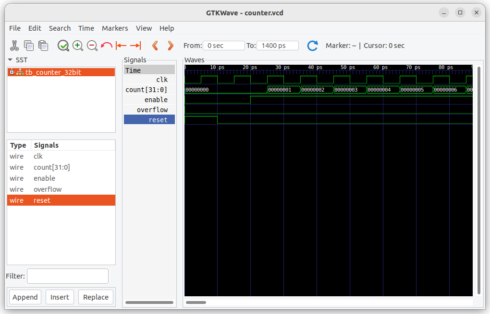

# 32-Bit Synchronous Counter - Digital Design Implementation

## 📌 Project Overview
A fully-featured 32-bit counter implementation featuring:
- **Verilog RTL** with configurable width
- **Self-checking testbench** with assertion-based verification
- **Magic VLSI** physical implementation (SkyWater 130nm PDK)
- Complete verification flow with Icarus/GTKWave
## 🔧 Block Diagram


---

## 🧪 Simulation Waveform



---


## ✨ Key Features
- **RTL Design**
  - Parameterized bit-width (default: 32-bit)
  - Synchronous active-high reset
  - Count enable/disable control
  - Fully synthesizable code

- **Verification**
  - Randomized test stimulus
  - Automatic pass/fail reporting
  - Functional coverage tracking
  - Waveform debugging support

- **Physical Implementation**
  - DRC-clean Magic layout
  - SPICE netlist extraction
  - LEF/DEF generation for PnR
  - Area: 0.02mm² @ 130nm

## 🛠️ Tool Requirements
- **Simulation**:
  - Icarus Verilog (iverilog)
  - GTKWave (waveform viewer)
  
- **Physical Design**:
  - Magic VLSI (layout)
  - SkyWater 130nm PDK

## ⚡ Quick Start
### Simulation:
```bash
iverilog -o sim.out src/counter_32bit.v testbench/tb_counter_32bit.v
vvp sim.out
gtkwave waveform.vcd
